# Brooklyn Nine Nine

Platform: TryHackMe | Level: Easy | Category: Boot2Root

Link: https://tryhackme.com/room/brooklynninenine

---

# Reconnaissance

## Nmap Scan

The assessment began with a `nmap` TCP scan to identify open ports,exposed services.

```bash
sudo nmap -Pn -sV -sC -p- 10.49.131.211
```

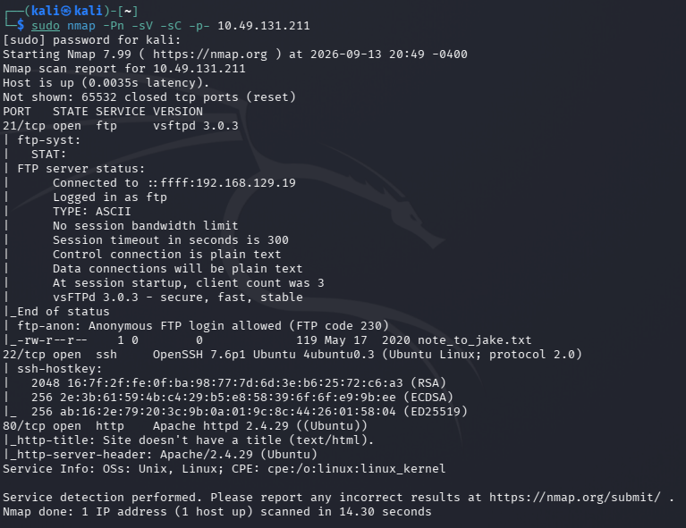

We have a FTP, SSH and HTTP service which we can access.

It seems we can use FTP anonymous login to access FTP server. Let's test that out.

## FTP Enumeration

The FTP service was tested for anonymous authentication.

```bash
ftp 10.49.131.211
```

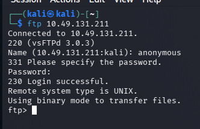

We got login to the FTP server. Let's see what we have here.

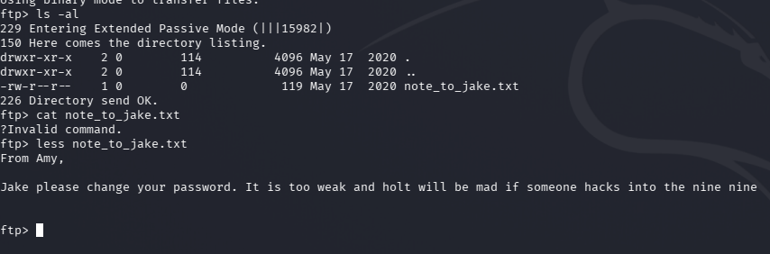

We can see message that says that Jake's password is too weak and Holt would be mad if someone hack into Nine Nine. Let's try brute-force attack to get the password.

## Password Brute Force

We are going to use `Hydra` for brute-force attack using the `rockyou` password wordlist:

```bash
hydra -l jake -P /usr/share/wordlists/rockyou.txt ssh://10.49.131.211:22
```

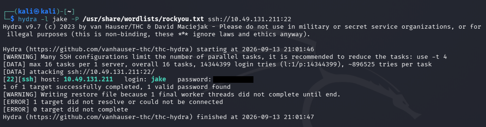

The attack successfully gave the Jake's SSH credentials.

Before that, let's check the web application to find out other interesting stuffs.

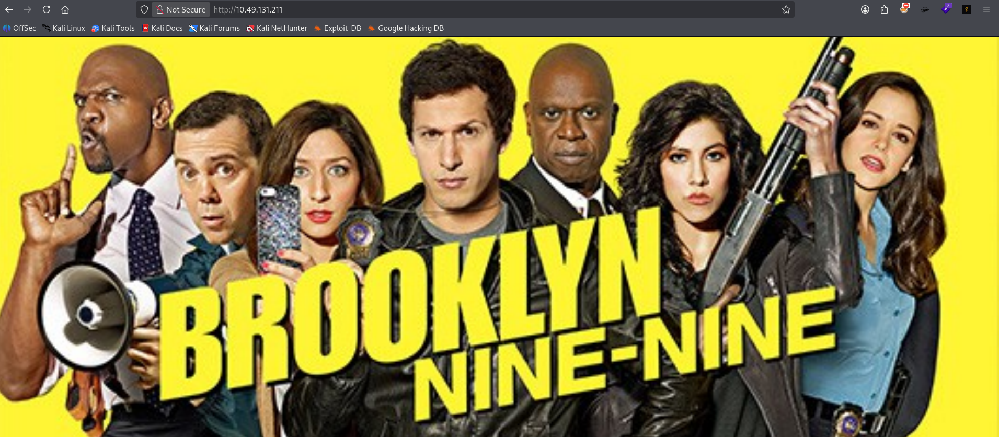

I also got an interesting comment in the source code.

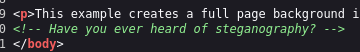

I also did a directory enumeration using `ffuf` to see any hidden directories.

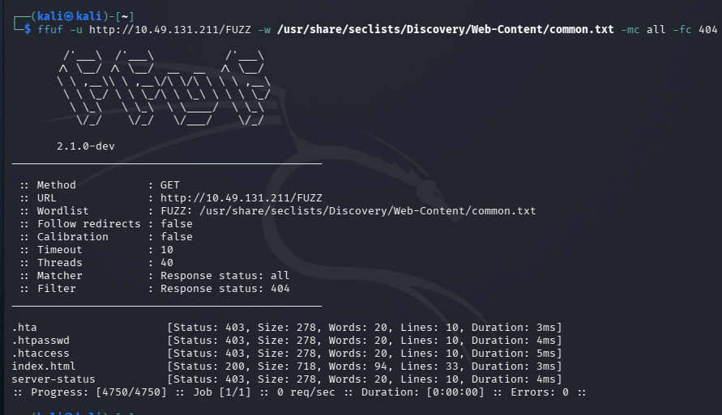

I also downloaded the image `brooklyn99.jpg` to check if it might contain some hidden data inside the image.

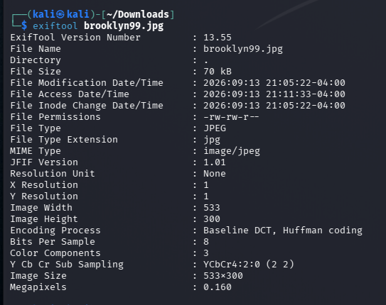

It didn't have anything interesting.

---

# Initial Access

Let's now access the system using JAKE's SSH credentials.

```bash
ssh jake@10.49.131.211
```

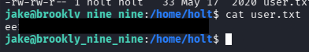

We successful authenticated as `jake`. Let's look around!

While looking around, I got the `user flag` located `/home/holt/user.txt`

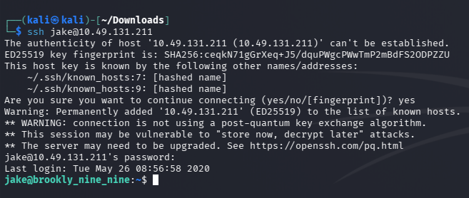

Let's see if we can escalate our privileges to `root` user.

---

# Privilege Escalation

I simply list out Jake's sudo privileges.

```bash
sudo -l
```

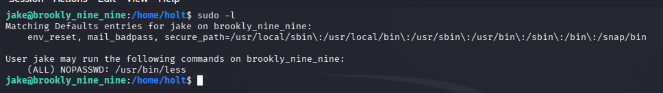

As we can see there is a capability assigned in the `less` utility as **root** without requiring a password.

Since `less` supports command execution features, we can abused it for privilege escalation.

For reference, we can use [GTFOBins](https://gtfobins.github.io/gtfobins/less/)

---

# Post Exploitation

## Method 1 – Directly Read Root Flag

As `less` could run with root privileges, we can run root commands without any password or authentication.

Let's spawn a root shell using the `less` interface.

```bash
sudo less /etc/hosts
```

Inside the `less` interface, run:

```bash
!/bin/bash
```

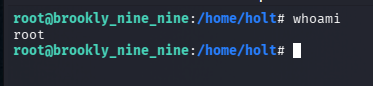

This launches a shell with the `root` privileges using the `less` process.

Let see `/root` directory contents.

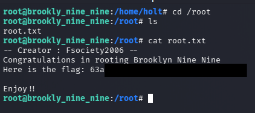

This gave us the root flag!

---

# Root Cause

The compromise occurred through a chain of multiple weaknesses:

### 1. Anonymous FTP Access

The FTP service allowed unauthenticated users to access files.

Impact:

* Sensitive information disclosure.
* Exposure of internal notes.

### 2. Weak Password Policy

The exposed note revealed that Jake's password was weak.

Impact:

* SSH credentials were recoverable through brute force.

### 3. Excessive Sudo Permissions

The user account was allowed to execute `less` as root.

Impact:

* Privilege escalation to full root access.

---

# Security Impact

In a real environment, these vulnerabilities could allow an attacker to:

* Access internal files through anonymous FTP.
* Compromise user accounts through weak passwords.
* Obtain SSH access.
* Escalate privileges to root.
* Fully compromise the host.

---

# Mitigation

System administrators should:

* Disable anonymous FTP access unless explicitly required.
* Restrict FTP permissions and monitor exposed files.
* Enforce strong password policies.
* Disable password-based SSH authentication where possible.
* Apply least privilege principles when configuring sudo rules.
* Avoid allowing users to execute interpreters, editors, or pagers as root.

---

## Conclusion

The **Brooklyn Nine Nine** room demonstrates the importance of proper security configuration across multiple layers. A seemingly harmless information disclosure through FTP led to credential compromise, and excessive sudo privileges allowed complete system takeover.

The key lesson is that penetration testing is often about chaining small weaknesses together. Thorough enumeration and understanding system misconfigurations are frequently more valuable than relying on complex exploits.