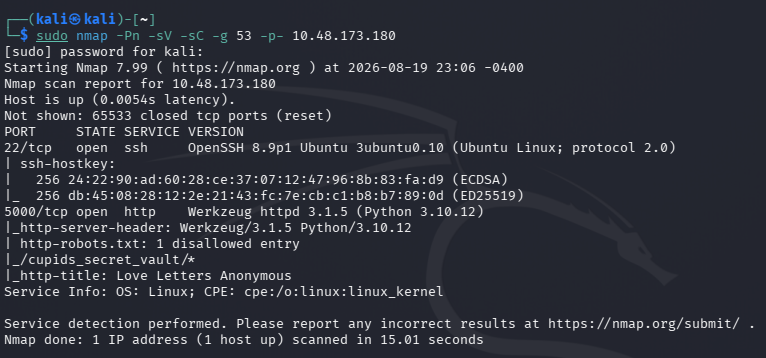
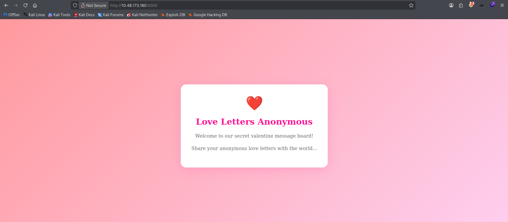
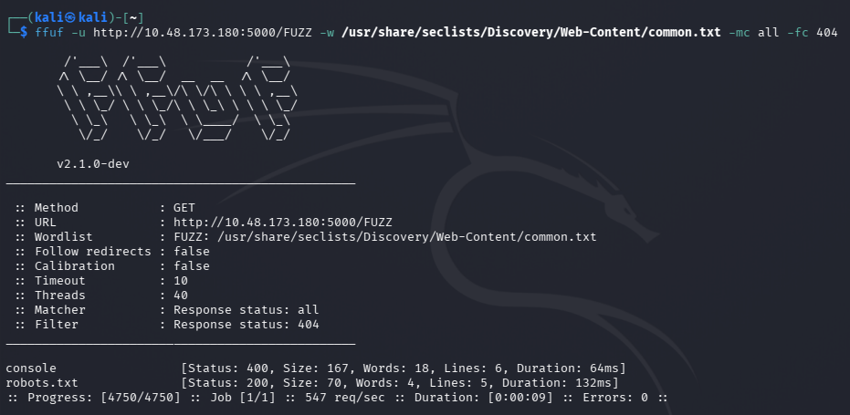
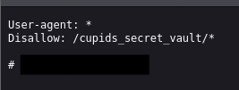
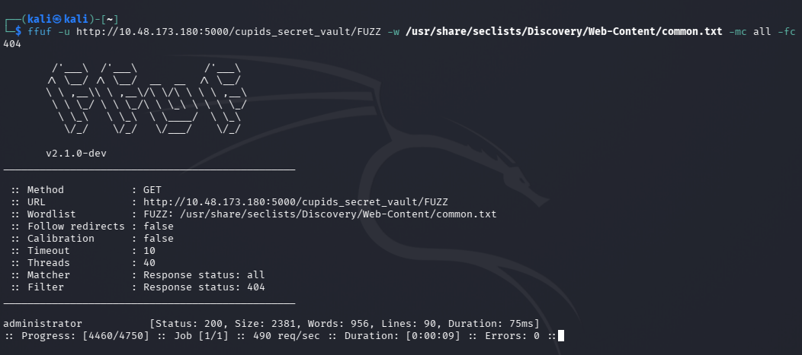
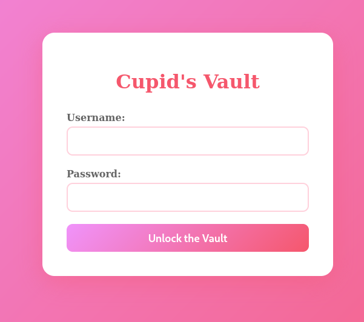
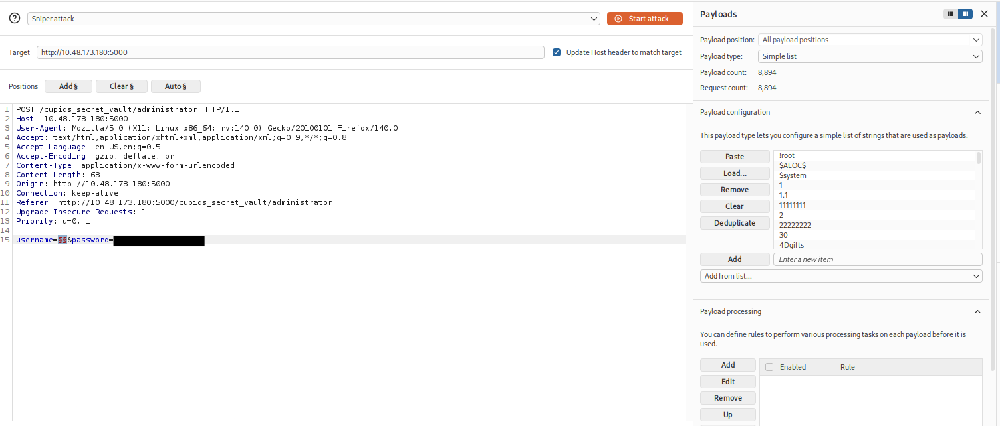
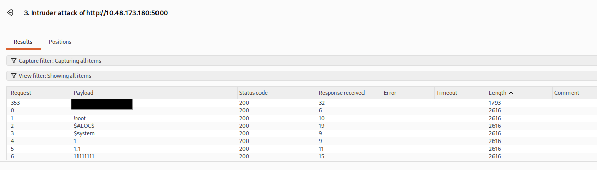
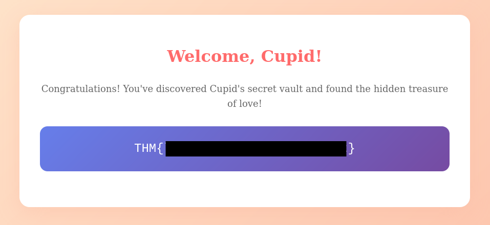
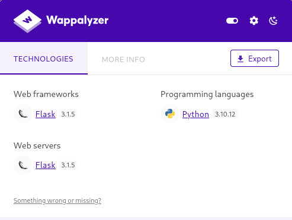

# Hidden Deep Into My Heart

**Platform:** TryHackMe
**Difficulty:** Easy
**Category:** Web
**Target:** `http://10.48.173.180:5000`

---

## 1. Overview

**Hidden Deep Into My Heart** is an easy-level web challenge involving web enumeration, `robots.txt` discovery, hidden directories, information disclosure, and username brute-forcing.

The application initially appeared to be a simple static webpage. However, enumeration revealed a hidden path through `robots.txt`. This path eventually led to an administrator login page.

A password-like string was also exposed in `robots.txt`. Since the password was known but the username was not, Burp Suite Intruder was used to brute-force the username and gain access to the administrator panel.

---

# 2. Reconnaissance

## Nmap Scan

I started with an Nmap scan to identify open ports and services running on the target:

```bash
sudo nmap -Pn -sV -sC -g- 10.48.173.180
```



The scan shows there is a disallowed entry in `robots.txt`.
It didn't reveal anything particularly interesting apart from the ssh service and web application.

So I moved to the web application.

---

# 3. Web Application Enumeration

The webpage appeared to be a simple static website.



There were no obvious login forms, API endpoints, or interesting functionality exposed directly on the homepage.

Since the application did not reveal much through manual inspection, I proceeded with directory enumeration to find out any other directories.

---

# 4. Directory Enumeration

I used **FFUF** with the SecLists common wordlist:

```bash
ffuf -u http://10.48.173.180:5000/FUZZ -w /usr/share/seclists/Discovery/Web-Content/common.txt -mc all -fc 404
```



Nothing interesting here as I was unable to access the `console` directory.

---

# 5. robots.txt Enumeration

I accessed the `robots.txt` which contained:



The important information here was the disallowed directory:

```text
/cupids_secret_vault/*
```

The comment also contained a string that appeared to be a password.

### Important Observation

`robots.txt` is **not an access-control mechanism**.

A `Disallow` entry only tells search-engine crawlers which paths should not be indexed. It does not prevent users from directly accessing those paths.

In this case, the `robots.txt` file effectively disclosed the location of a hidden application area.

---

# 6. Enumerating the Hidden Directory

Since the `robots.txt` file revealed:

```text
/cupids_secret_vault/
```

I performed another FFUF scan against this directory:

```bash
ffuf -u http://10.48.173.180:5000/cupids_secret_vault/FUZZ -w /usr/share/seclists/Discovery/Web-Content/common.txt -mc all -fc 404
```



This presented an another directory location.

---

# 7. Administrator Login

I went to the directory and found out a login page.



At this point, I already had a password-like string from `robots.txt`.

All I needed was the the username for the loginpage.

Instead of guessing manually, I intercepted the login request using **Burp Suite** and sent it to **Burp Intruder**.



---

# 8. Username Brute Force

I configured Intruder for a **Sniper** attack.

The username parameter was selected as the attack position, while the password obtained from `robots.txt` was kept constant.

Conceptually, the attack looked like:

```text
Username: FUZZ
Password: <password discovered from robots.txt>
```

I supplied a username wordlist and started the attack.

The responses came was interesting. Expect a single username, every other code length were the same.



So I used that username to login.

---

# 9. Administrator Access

And the username was correct which logged me into the administrator panel.

The room flag was present there.



---

# 10. Attack Chain

```text
Nmap Scan
    ↓
Web Application on Port 5000
    ↓
Static Webpage
    ↓
FFUF Directory Enumeration
    ↓
robots.txt
    ↓
Disallowed /cupids_secret_vault/*
    ↓
Password-like String Disclosed
    ↓
FFUF Enumeration of /cupids_secret_vault/
    ↓
/administrator
    ↓
Administrator Login Page
    ↓
Known Password + Unknown Username
    ↓
Burp Suite Intruder
    ↓
Username Brute Force
    ↓
Valid Username Discovered
    ↓
Administrator Login
    ↓
Room Flag
```

---

# 11. Vulnerabilities Identified

The challenge demonstrates several weaknesses working together.

1. Sensitive Information Disclosure : A password-like secret was placed inside `robots.txt`.

2. Security Through Obscurity : The application relied on a supposedly hidden directory but the directory was discoverable through `robots.txt`.

3. Exposed Administrative Endpoint : The administrator login was accessible at `/cupids_secret_vault/administrator`.

4. Weak Authentication : The login functionality apparently lacked sufficient protections against automated authentication attempts.

5. Missing Login Protection : The login endpoint allowed repeated username attempts without an effective mechanism which made attacks like brute-forcing possible.

---

# 12. Security Impact

The vulnerabilities can be chained together to obtain unauthorized administrative access.

The overall impact can be represented as:

```text
Publicly accessible robots.txt
        ↓
Hidden directory disclosure
        ↓
Credential disclosure
        ↓
Administrator endpoint discovery
        ↓
Username brute force
        ↓
Valid credentials
        ↓
Administrative access
```

An attacker could potentially gain access to functionality intended only for administrators.

Depending on what the administrator panel controls, this could lead to:

* Unauthorized access to sensitive information
* Modification of application data
* Administrative account compromise
* Further application compromise
* Potential server-side compromise if privileged functionality is exposed

---

# 13. Mitigations

1. Sensitive Information Disclosure : Sensitive credentials passwords, API keys, tokens, or other secrets should never be stored in publicly accessible files like `robots.txt`.

2. Security Through Obscurity:
    - Hidden URLs should never be treated as a security boundary.
    - Implement actual authentication and authorization controls on sensitive resources.

3. Exposed Administrative Endpoint : Administrative functionality should require proper authentication and authorization.

4. Weak Authentication : The login functionality apparently lacked sufficient protections against automated authentication attempts.

5. Missing Brute-Force Protection : The login endpoint allowed repeated username attempts without an effective mechanism such as:

* Rate limiting
* Account lockout
* CAPTCHA
* Progressive delays
* IP-based throttling
* Credential-stuffing detection

6. Store Credentials Securely : Passwords should be securely hashed using an appropriate password hashing algorithm such as:

* Argon2
* bcrypt
* scrypt

---

# 14. Tools Used

| Tool          | Purpose                                    |
| ------------- | ------------------------------------------ |
| Nmap          | Port and service enumeration               |
| FFUF          | Directory/content enumeration              |
| Burp Suite    | HTTP request interception and manipulation |
| Burp Intruder | Username brute-force testing               |
| Browser       | Manual web application enumeration         |

---

# 15. Key Takeaways

This room demonstrates why apparently minor information disclosures can become serious when chained together.

The most important lessons were:

1. **Always inspect `robots.txt`.**
2. **Never treat `robots.txt` as an access-control mechanism.**
3. **Run directory enumeration against interesting paths discovered during reconnaissance.**
4. **Look for credentials and secrets in publicly accessible files.**
5. **Test authentication mechanisms for username enumeration.**
6. **Check whether login endpoints implement brute-force protections.**
7. **Think in terms of attack chains rather than isolated vulnerabilities.**

---

# 16. Conclusion

The challenge initially presented a seemingly static webpage with very little functionality.

However, systematic enumeration revealed `robots.txt`, which exposed both a hidden application path and a password-like secret. Further directory enumeration uncovered the administrator login page. Since only the username remained unknown, Burp Suite Intruder was used to brute-force the username while reusing the disclosed password.

After discovering the valid username, the administrator account could be accessed and the room flag retrieved.

The key lesson is that **information disclosure, poor authentication controls, and hidden administrative endpoints can become significantly more dangerous when chained together.**




ffuf -u http://10.48.173.180:5000/FUZZ -w /usr/share/seclists/Discovery/Web-Content/common.txt -mc all -fc 404


ffuf -u http://10.48.173.180:5000/cupids_secret_vault/FUZZ -w /usr/share/seclists/Discovery/Web-Content/common.txt -mc all -fc 404


