# RootMe

Platform: TryHackMe | Level: Easy | Category: Boot2Root

Link: https://tryhackme.com/room/rrootme

---

# Reconnaissance

## Nmap Scan

The assessment began with a `nmap` TCP port scan to identify open ports, available services etc.

```bash
sudo nmap -Pn -sV -sC -p- -g 53 10.49.172.64
```

Change the source port to `53` DNS which will bypass the firewall blocking the scan. You can also try other firewall evasion techniques such as `decoy scan`, `null scan` or `xmas scan`.

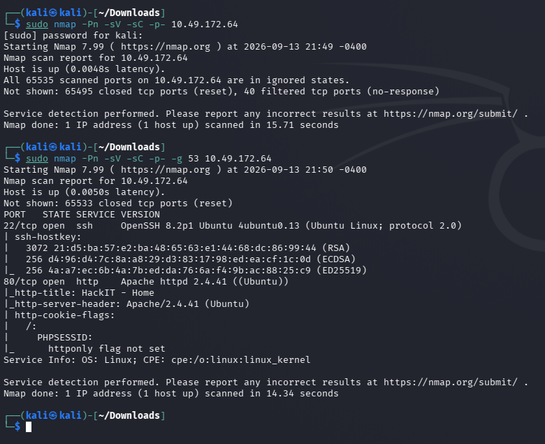

It seems a SSH and HTTP web application service are open.

---

# Directory Enumeration

I used `ffuf` with `seclists` wordlists. You use any other also.

```bash
ffuf -u http://10.49.172.64/FUZZ -w /usr/share/seclists/Discovery/Web-Content/common.txt -mc all -fc 404
```

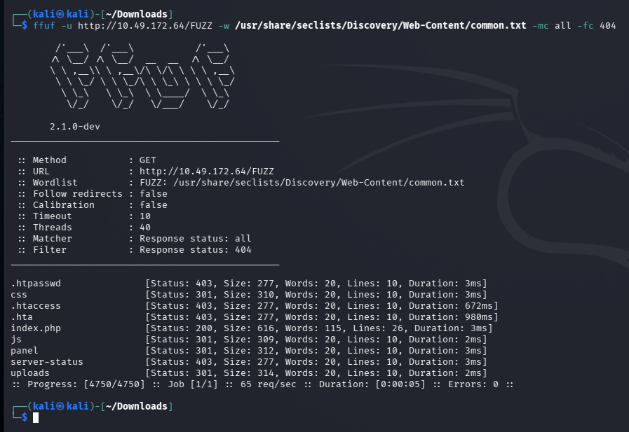

## Questions

Scan the machine, how many ports are open? => `2`

What version of Apache is running? => `2.4.41`

What service is running on port 22? => `SSH`

Find directories on the web server using the GoBuster tool. => You can use any directory enumeration tool such as `gobuster`, `ffuf` or `feroxbuster` etc.

What is the hidden directory? => `/panel/`

---

# Getting a Shell

## Initial Access

It seems the `/panel` have a file upload function which can be used to upload files in the web application.

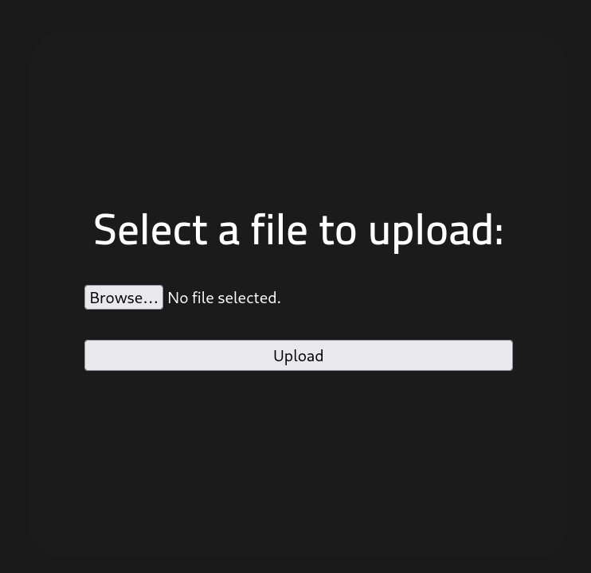

It seems the upload function accepts anything an user supplies, let's see what all it takes!

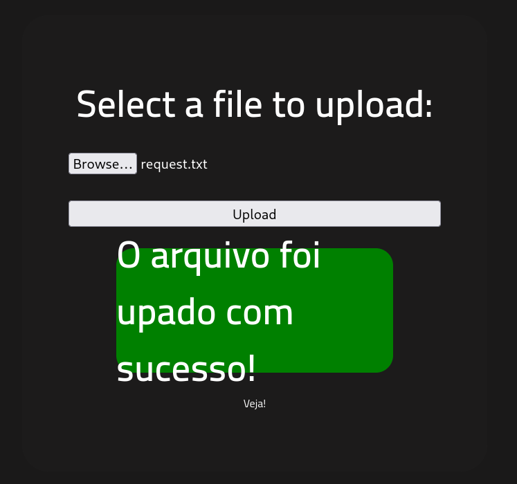

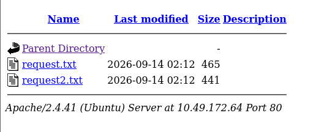

Let's try to add a PHP reverse shell to get a shell access.

We are going to use [Revshells](https://www.revshells.com/) to create a `PHP` reverse shell.

Change the IP to your attacker machine IP.

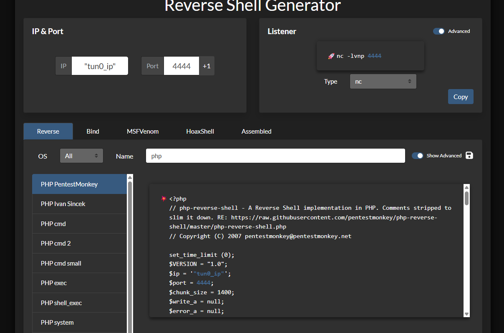

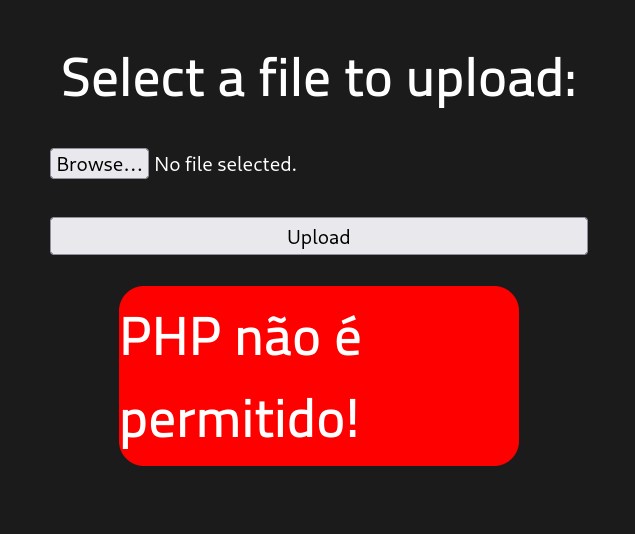

It seems the application is blocking file upload for `.php` extension file.

We can bypass this by simply changing the extension to `.phtml` as it is a web template file containing HTML markup mixed with inline PHP code.

This will be executed as a PHP file without any restrictions.

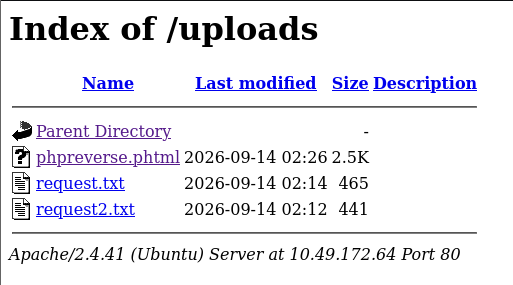

Let's get the shell access using Netcat utility `nc`.

After uploading the file, start a `nc` listener and click on your reverse shell file to get the shell.

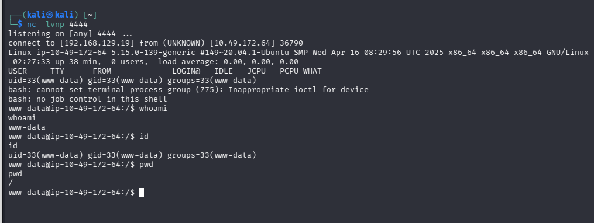

let's look around for the `user.txt` file.

```bash
find / -type f -name user.txt 2>/dev/null
```

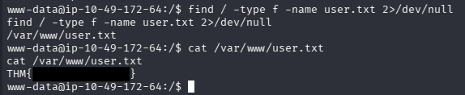

We got the user flag. Now let's escalate our privileges.

---

# Privilege Escalation

Let's see what else we can find!

```bash
find / -type f -perm -4000 2>/dev/null
```

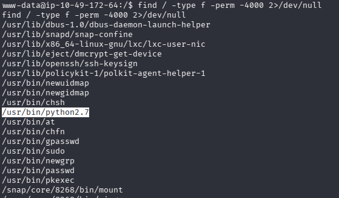

As we can see, `python` is configured with **SUID** permission bit, it can potentially execute commands with elevated privileges such as `root`.

Using [GTFOBins](https://gtfobins.org/gtfobins/python/), we can spawn shell with elevated privileges.

```bash
python -c 'import os; os.execl("/bin/bash", "bash", "-p")'
```

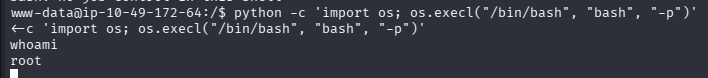

We successfully spawned a shell with root access.

Let's search for the `root.txt` file.

```bash
find / -type f -name root.txt 2>/dev/null
```

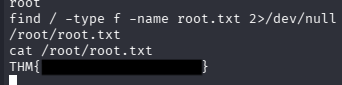

This gave the root flag.

---

# Root Cause

The compromise resulted from chaining two independent vulnerabilities:

1. **Unrestricted File Upload**

   * The upload filter blocked `.php` files but failed to prevent executable alternatives such as `.phtml`.
   * This allowed arbitrary PHP code execution.

2. **Misconfigured SUID Binary**

   * The Python interpreter was assigned the SUID permission bit.
   * Because Python can execute arbitrary operating system commands, it could be abused to obtain a root shell.

Neither issue alone should exist on a production system, but together they allowed complete system compromise.

---

# Security Impact

If present in a production environment, these vulnerabilities could allow an attacker to:

* Upload and execute arbitrary server-side code.
* Gain remote command execution.
* Establish persistent access.
* Escalate privileges to root.
* Obtain complete control over the server.

---

# Mitigation

Developers and system administrators should:

* Validate uploads using MIME type verification rather than file extensions alone.
* Store uploaded files outside the web root.
* Disable execution permissions for upload directories.
* Remove unnecessary SUID permissions from interpreters such as Python.
* Regularly audit SUID binaries.
* Apply the principle of least privilege across all services and binaries.

---

## Key Takeaways

* File upload functionality should always be treated as a high-value attack surface.
* Extension filtering alone is insufficient to prevent malicious uploads.
* Always enumerate SUID binaries during Linux privilege escalation.
* GTFOBins is an invaluable resource for assessing privileged Unix binaries.
* Successful compromises often result from chaining multiple smaller vulnerabilities.

---

## Conclusion

The **RootMe** room demonstrates a realistic attack chain that combines web application exploitation with Linux privilege escalation. It reinforces several fundamental penetration testing concepts, including systematic enumeration, bypassing insecure file upload validation, establishing remote command execution, and leveraging misconfigured SUID binaries to obtain root privileges. These techniques are commonly encountered during real-world security assessments, making the room an excellent introduction to practical web and Linux exploitation.