# Signed Messages

Platform: TryHackMe | Level: Medium | Category: Web

---

## Reconnaissance

First, I did a `nmap` scan to see if any other ports are open. We already knew our target is on port 5000, given in the challenge.

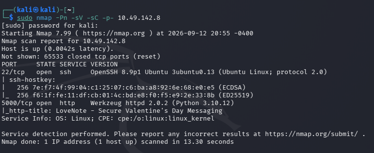

Nothing interesting here though, Let's check the web!

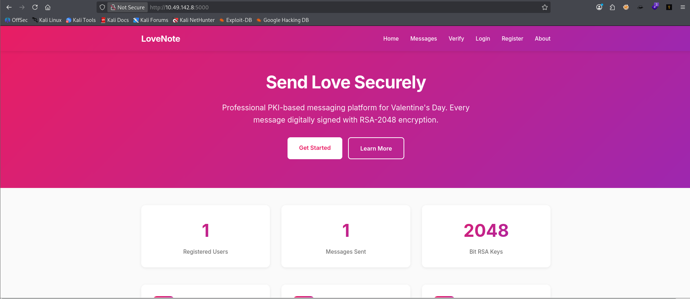

It seems the website is coded using `flask`, a lightweight micro web framework written in Python.

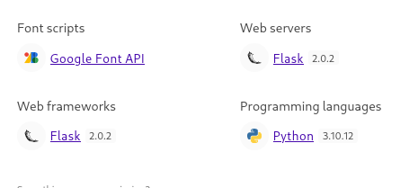

Here is some message left by the system admin.

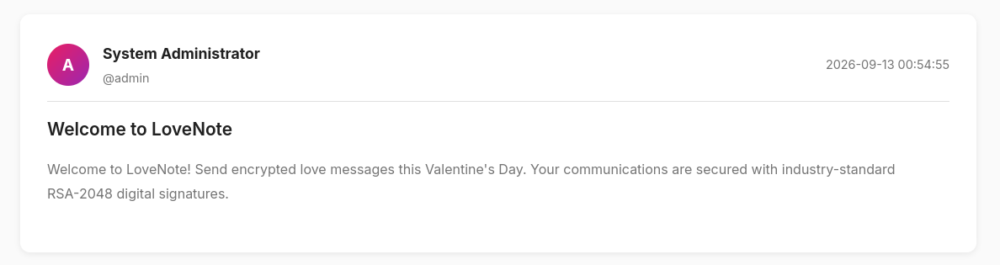

Here are some interesting stuff I guess, It seems we can login to the user dashboard without any authentication. And here is a security note for that:

```text
Security Notice

LoveNote uses your username to load your cryptographic keys. Your private key is stored securely on our server and is used to automatically sign messages you send.
```

I guess we can just check it out.

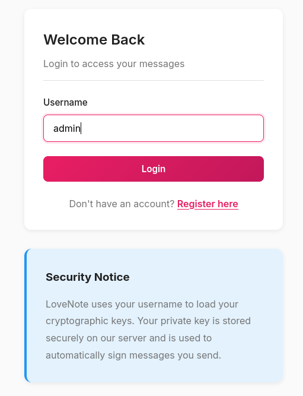

Okay we got the access to the admin's Dashboard. Let's check what we have here!

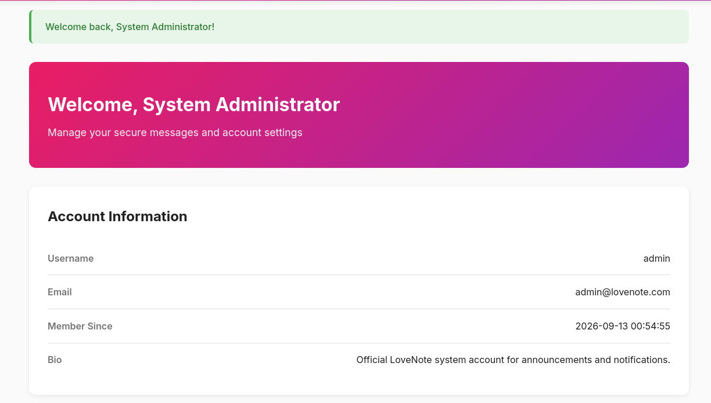

Here is a verification page which I guess verifies the `digital signature` of the account. Let's check how it works.

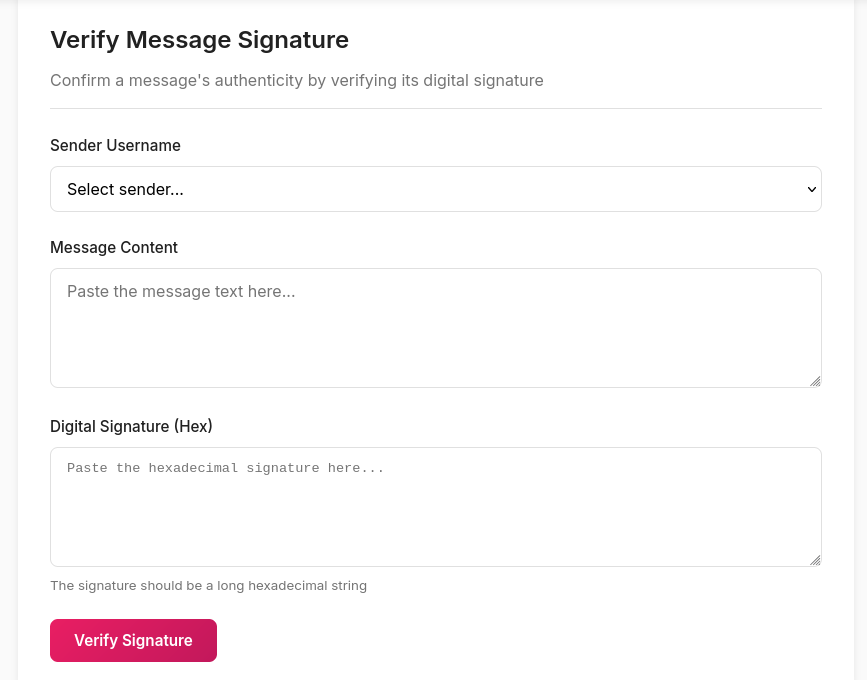

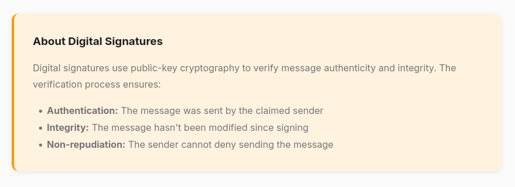

Let's do a directory enumeration using `ffuf` and see if we missed out any hidden directories.

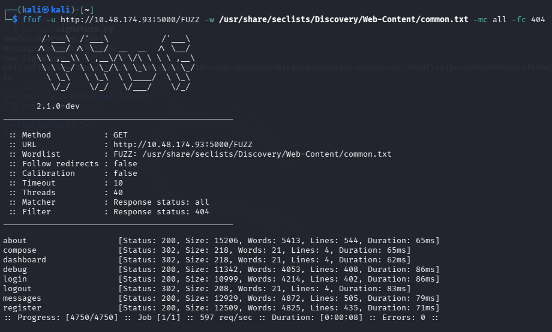

Among these directories, the `/debug` seems to be more interesting. Let's see what we have here.

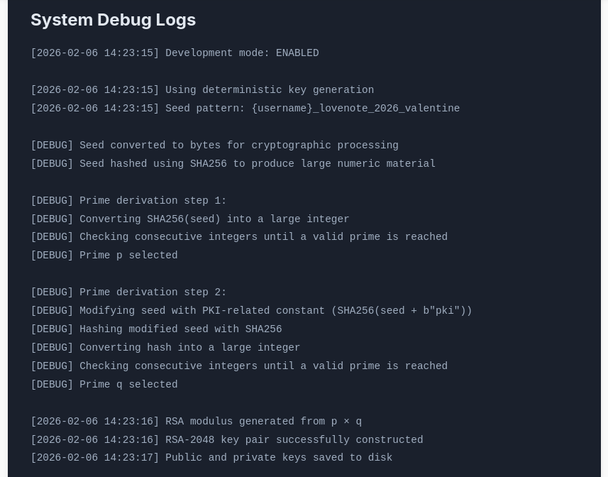

Here is the interesting part!

- The application is running in developer mode, which might enable debugging in the application.

- It also have the information about the cryptographic process like how the application generates a user's `RSA key`.

- Normally, when RSA keys are generated, unpredictable randomness numbers are used but here key generation is `deterministic` which means if two users have similar usernames, their keys are unrelated. This is a big vulnerability in the application.

- The application also revealed the seed pattern for the key generation `{username}_lovenote_2026_valentine`, since we know the username, we can calculate the seed value.

Using the `debug log`, I created a python scripyt which recreates the admin RSA private key from the predictable key-generation process, then uses that private key to create a digital signature that the server accepts as genuinely signed by `admin`.

# Exploitation

Here is the [script](./signature.py) for the challenge.

You also need these packages to run the script:

```bash
pip install sympy pycryptodome
```

If you are using your own attack machine like using `Openvpn` tunnel, I would recommend to use virtual environment to run the script.

```bash
sudo apt install python3-venv python3-pip -y

python3 -m venv thm-env

source thm-env/bin/activate

pip install sympy pycryptodome
```

Then run the script.

```bash
python signature.py
```

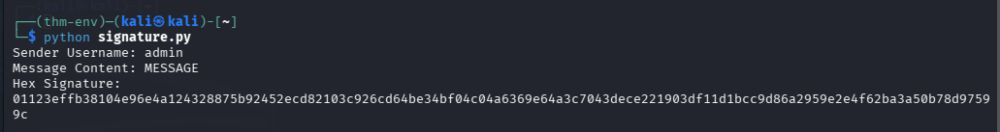

We got the `Digital signature` for the verification of the RSA key.

To deactivate venv, type `deactivate`.

Let fill the contents and see.

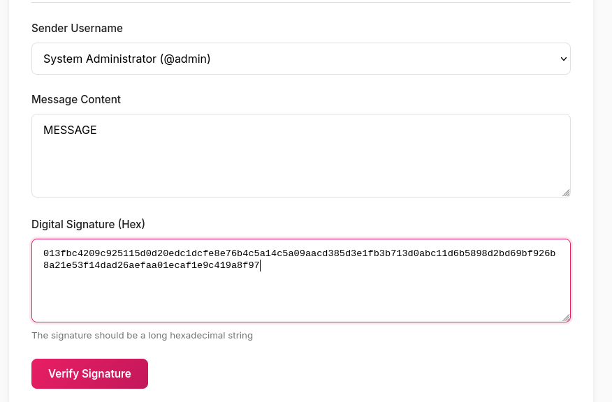

It verifed the signature and gave us the challenge flag.

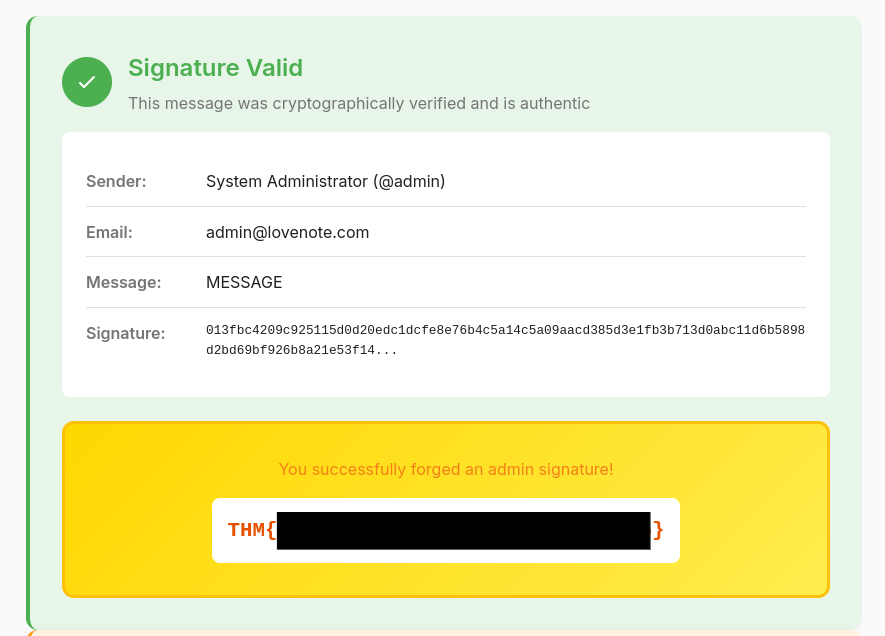

---

## Root Cause

The primary root cause was the website was trusting a user-controlled username for identity and cryptographic key selector without any verification.

It allowed an attacker to access the `admin` account simply by supplying the username `admin`, without requiring proper authentication or authorization.

Since the application used the username to load the corresponding cryptographic keys, gaining access to the admin identity also allowed the attacker to interact with the signing functionality as that user.

Additionally, the RSA key generation process was **deterministic and predictable**. The debug information exposed the seed pattern:

```text
{username}_lovenote_2026_valentine
```

The application then derived the RSA primes from predictable SHA-256 values. Knowing the username therefore allowed the RSA keypair to be reconstructed.

This broke the fundamental security assumption that a user's private signing key was secret and exclusively controlled by the legitimate user.

---

## Security Impact

The vulnerability allows an attacker to **impersonate other users**, including privileged accounts such as `admin`.

In a real-world application, the same weakness could allow attackers to:

* Impersonate privileged users.
* Forge digitally signed messages.
* Bypass signature-based authorization controls.
* Perform actions that require a trusted cryptographic identity.
* Compromise the integrity and authenticity of messages.
* Potentially escalate privileges if signatures are used for authorization.

The impact is therefore **high**, because the cryptographic trust model can be completely bypassed.

---

## Mitigation

### 1. Implement Proper Authentication

A username must never be treated as proof of identity.

Use a secure authentication mechanism such as:

* Strong password authentication.
* Secure session management.
* Multi-factor authentication for privileged accounts.
* Proper server-side authorization checks.

### 2. Generate RSA Keys Using Cryptographically Secure Randomness

RSA primes must never be derived from predictable values such as usernames or static strings.

Use a cryptographically secure random number generator provided by a trusted cryptographic library.

For example, applications should rely on established RSA key-generation APIs rather than implementing deterministic prime generation.

### 3. Never Derive Private Keys From Usernames

Usernames are public information and therefore unsuitable as cryptographic secrets.

The private key should be generated independently and stored securely.

### 4. Protect Private Keys

Private keys should:

* Never be exposed through debug output.
* Never be derivable from public information.
* Be protected with appropriate filesystem/database permissions.
* Ideally be stored using a dedicated key-management system for sensitive applications.

### 5. Disable Debug Information in Production

The application exposed internal cryptographic implementation details, including the deterministic seed-generation process.

Production systems should disable debug logging that reveals:

* Cryptographic seeds.
* Key-generation algorithms.
* Internal paths.
* Secrets.
* Authentication information.
* Implementation details useful for exploitation.

### 6. Enforce Authorization Server-Side

Access to an account or signing operation must be based on an authenticated session and authorization checks, not simply:

```text
username = admin
```

Every privileged operation should verify that the authenticated user is actually authorized to perform it.

---

## Key Takeaways

* A username is an **identifier**, not an authentication mechanism.
* Cryptographic private keys must be generated using **unpredictable randomness**.
* Deterministic RSA key generation based on public information completely defeats the purpose of public-key cryptography.
* Exposed debug information can reveal enough implementation details to reconstruct cryptographic material.
* Digital signatures provide authenticity only when the signing private key remains secret.
* Authentication, authorization, and cryptographic verification must work together; a strong cryptographic algorithm cannot compensate for a broken trust model.
* In this challenge, combining the authentication flaw with predictable key generation allowed complete **identity impersonation and signature forgery**.

---

## Conclusion

The Signed Message challenge demonstrates how multiple weaknesses can combine to completely undermine a security architecture.

Although LoveNote claimed to use RSA-2048 digital signatures and a PKI-based trust model, the system trusted a user-controlled username for account access and cryptographic key selection. Furthermore, the RSA key generation process was deterministic and based on predictable information.

By accessing the `admin` identity, reproducing the predictable RSA keypair, and generating a valid signature, it was possible to make a forged message appear to originate from the administrator.

The key lesson is that **cryptography is only as secure as the way it is implemented and integrated into the application's authentication and authorization model**.

---

| Category         | Value                                                                                  |
| ---------------- | -------------------------------------------------------------------------------------- |
| **Type**         | Predictable Cryptographic Key Generation / RSA Private Key Reconstruction              |
| **CWE**          | **CWE-330: Use of Insufficiently Random Values**                                       |
| **CWE**          | **CWE-338: Use of Cryptographically Weak Pseudo-Random Number Generator (PRNG)**       |
| **CWE**          | **CWE-321: Use of Hard-coded Cryptographic Key**                                       |
| **OWASP Top 10** | **A07: Identification and Authentication Failures**                                    |
| **OWASP Top 10** | **A02: Cryptographic Failures**                                                        |
| **Impact**       | Identity Impersonation, Digital Signature Forgery, Authentication/Authorization Bypass |
| **Severity**     | **High**                                                                               |