# TryHeartMe

Platform: TryHackMe | Level: Easy | Category: Web

---

## Reconnaissance

First, I did a `nmap` scan to check if there is any other open ports.

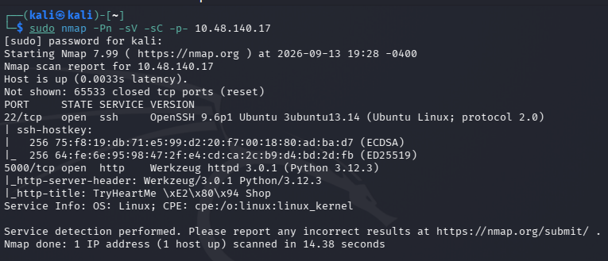

Nothing interesting, let's go and check the web application.

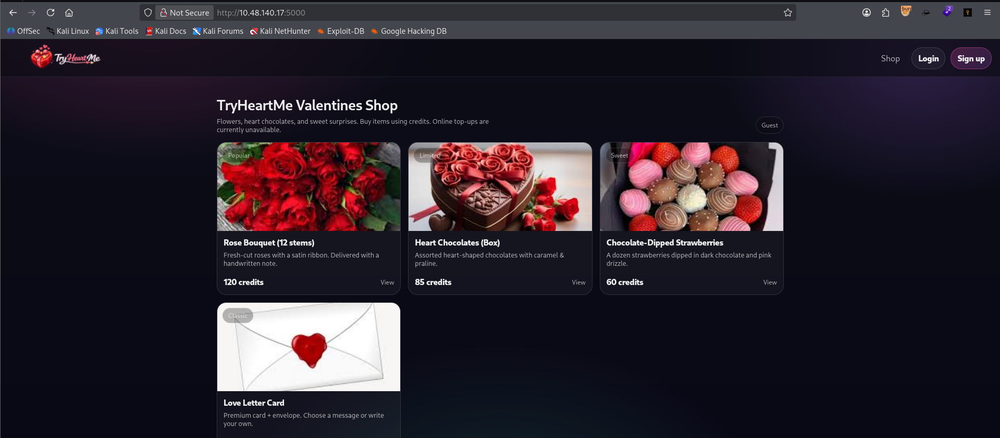

Looks like a Valentines Online Shop which sells gift, chocolates etc.

Let's do a directory enumeration to check any hidden directories.

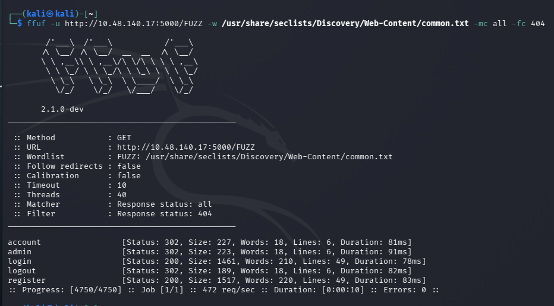

Let's see if we can access the `/admin` page.

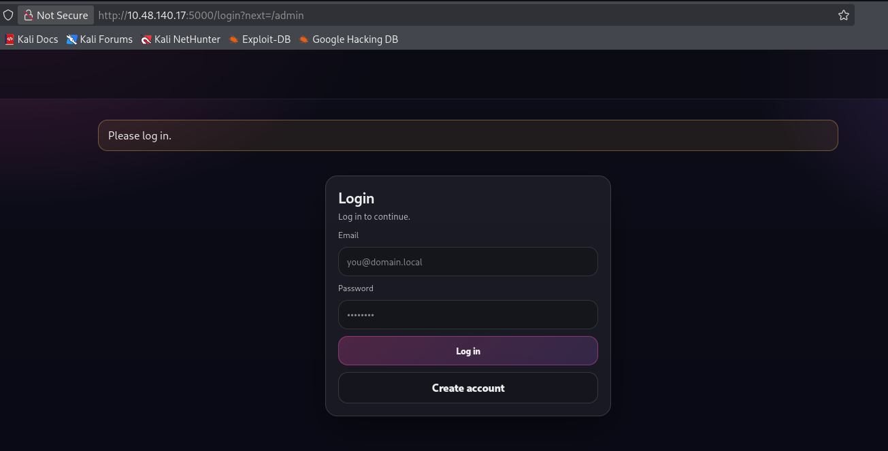

It seems we have to be authenticated to access the `admin` page. Let's see what we can do.

Let's create an account to login to the application.

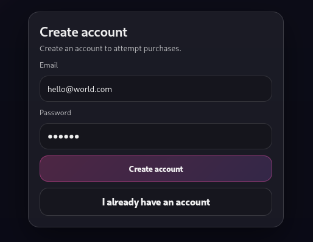

Here we are, We created and logged in as a user in the application.

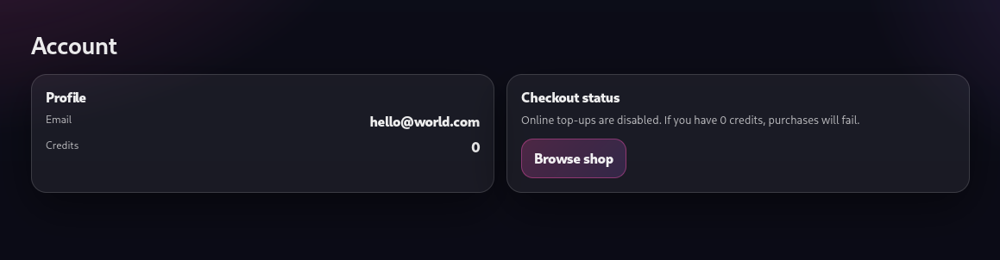

The source didn't had anything interesting but we got a JWT token of the account we just created and used to login.

Let's see if we can modify the token and use it to access the `/admin` page.

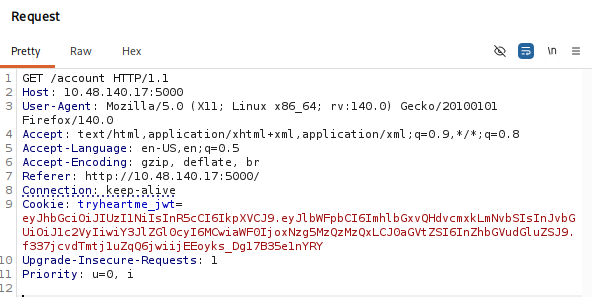

---

# Exploitation

I am using [JWT Debugger](https://www.jwt.io/) to change the JWT values, you can use the `JWT Editor` extension in `Burpsuite` also.

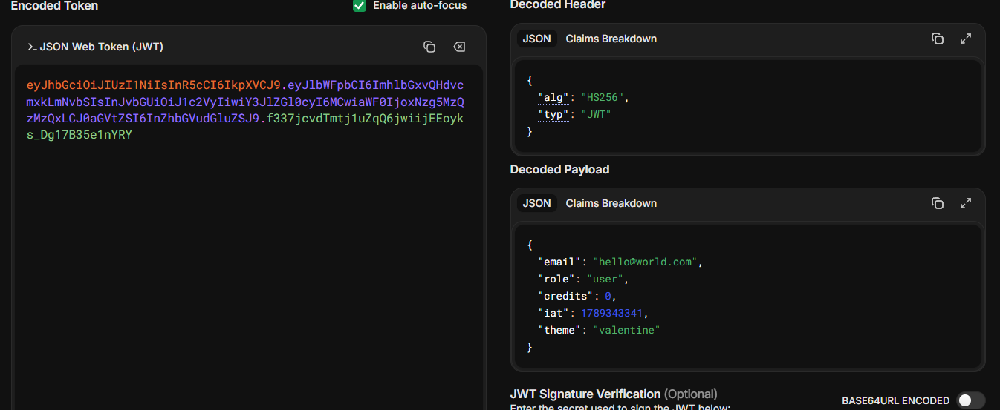

I changed the values to something like this.

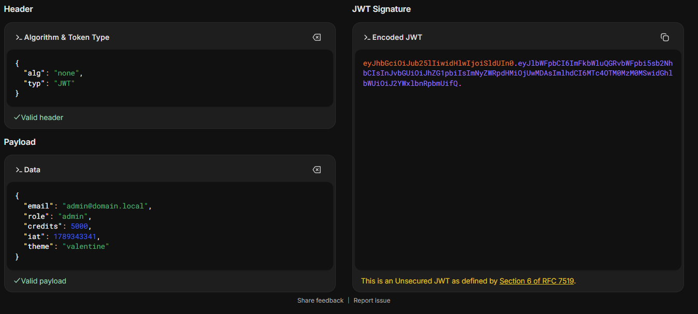

We got access to the `/admin` page, now let's retrive the flag.

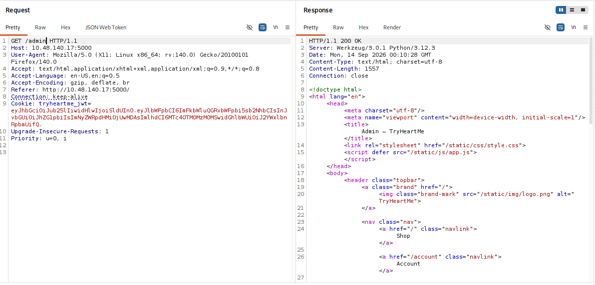

The application was not saving the login with the modified JWT token, so I captured each and every request for the `Valenflag` purchase and changed the cookie value to access the page.

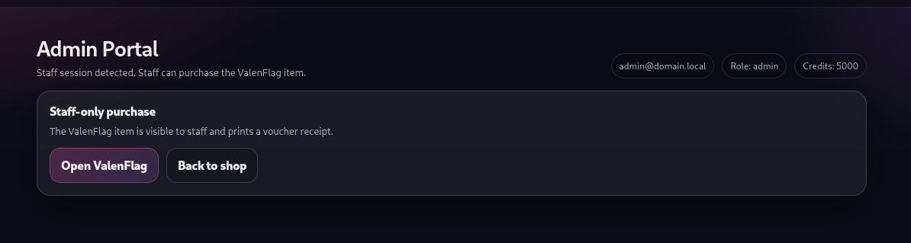

```html
GET /product/valenflag HTTP/1.1
Cookie: tryheartme_jwt=<modified.jwt.token>
```

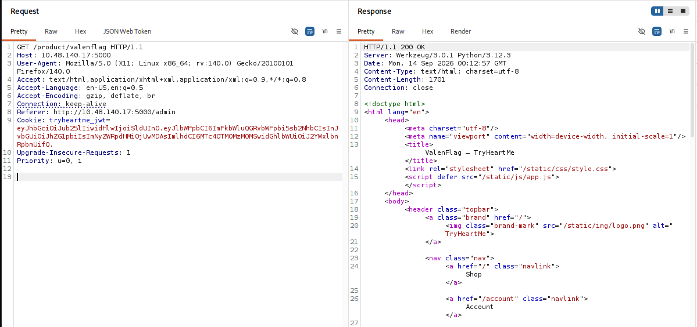

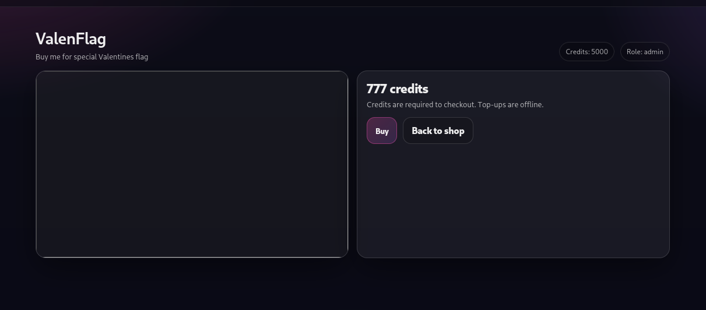

```html
GET /receipt/valenflag HTTP/1.1
Cookie: tryheartme_jwt=<modified.jwt.token>
```

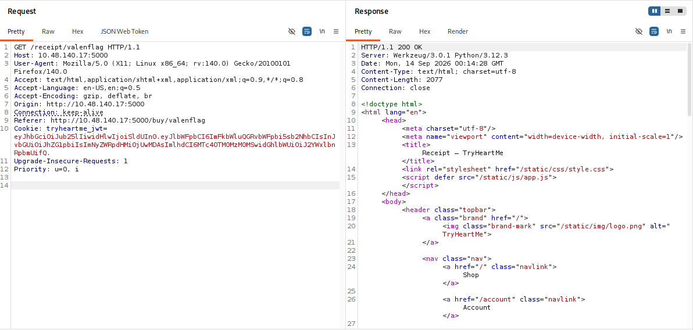

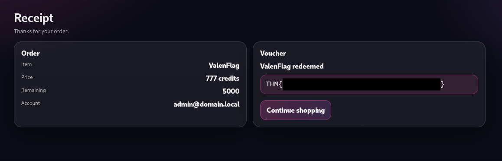

---

## Root Cause

The primary root cause was **improper JWT signature validation**.

The application accepted a JWT using the `none` algorithm and trusted the claims contained within the token without properly verifying its cryptographic signature.

The application also trusted security-sensitive client-controlled claims such as:

* `email`
* `role`
* `credits`

Because the server failed to enforce proper JWT validation, the attacker could modify:

```text
role = user
```

to:

```text
role = admin
```

and gain privileged access.

---

## Security Impact

Successful exploitation allowed a normal user to impersonate an administrator and bypass authorization controls.

Potential real-world impact includes:

* Authentication bypass.
* Privilege escalation.
* Administrator impersonation.
* Unauthorized access to restricted functionality.
* Manipulation of user privileges.
* Manipulation of application-controlled values such as credits.
* Access to sensitive administrative information.
* Potential modification or deletion of application data.

In this challenge, exploitation resulted in **administrator access and flag disclosure**.

---

## Mitigation

### 1. Enforce JWT Signature Verification

The server must verify the JWT signature before trusting any claims.

The application should explicitly define which algorithms are permitted, for example:

```text
HS256
```

and reject unexpected algorithms such as:

```text
none
```

### 2. Never Trust Client-Controlled Authorization Claims

Sensitive authorization decisions should not blindly rely on claims supplied by the client.

For example, instead of trusting:

```json
{
  "role": "admin"
}
```

the server should validate the authenticated user's privileges through trusted server-side data.

### 3. Use Strong JWT Secrets

When using HMAC-based algorithms such as HS256:

* Use a long, cryptographically random secret.
* Never use predictable secrets.
* Store secrets securely.
* Rotate secrets if compromise is suspected.

### 4. Validate JWT Claims

The application should properly validate important claims such as:

* `exp` — expiration time
* `iat` — issued-at time
* `iss` — issuer
* `aud` — audience
* `sub` — subject

### 5. Reject Unsigned Tokens

The application should reject JWTs using:

```text
alg: none
```

unless there is an explicitly controlled and justified use case.

---

## Key Takeaways

* JWT payloads are encoded, not encrypted, so users can inspect their contents.
* JWT claims should never be trusted without successful signature verification.
* The JWT `alg` header must not allow an attacker to select an insecure algorithm.
* The `none` algorithm results in an unsigned JWT.
* Authorization-related claims such as `role` require strong server-side validation.
* Authentication and authorization are different security controls.
* A JWT containing `"role": "admin"` does not prove that the user is actually an administrator.
* Proper cryptographic verification is essential before accepting JWT claims.

---

## Conclusion

The TryHeartMe room demonstrated a JWT authentication and authorization vulnerability caused by improper signature validation.

The application issued tokens using `HS256` but accepted a modified token using the `none` algorithm. Because the server trusted the modified JWT claims, the `role` value could be changed from `user` to `admin`.

This allowed a normal account to bypass authorization controls, impersonate an administrator, access the admin functionality, and obtain the flag.

The main lesson is that **JWT claims must never be trusted until the token's signature and security-critical claims have been properly validated on the server**.

---

## Vulnerability Classification

| Category                  | Value                                                                                  |
| ------------------------- | -------------------------------------------------------------------------------------- |
| **Type**                  | JWT Signature Validation Bypass / Privilege Escalation                                 |
| **Primary Vulnerability** | JWT `alg: none` Attack                                                                 |
| **CWE**                   | **CWE-347: Improper Verification of Cryptographic Signature**                          |
| **CWE**                   | **CWE-345: Insufficient Verification of Data Authenticity**                            |
| **OWASP Top 10**          | **A07: Identification and Authentication Failures**                                    |
| **OWASP Top 10**          | **A01: Broken Access Control**                                                         |
