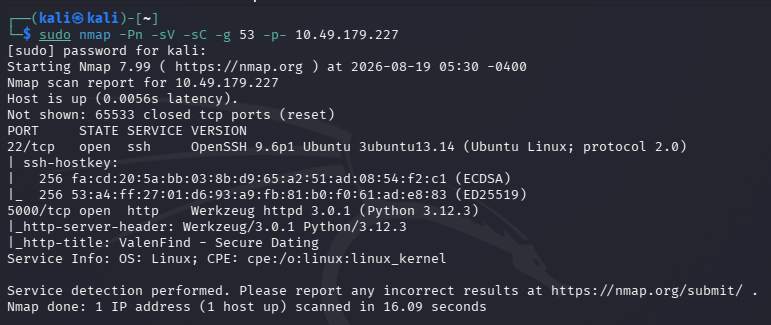
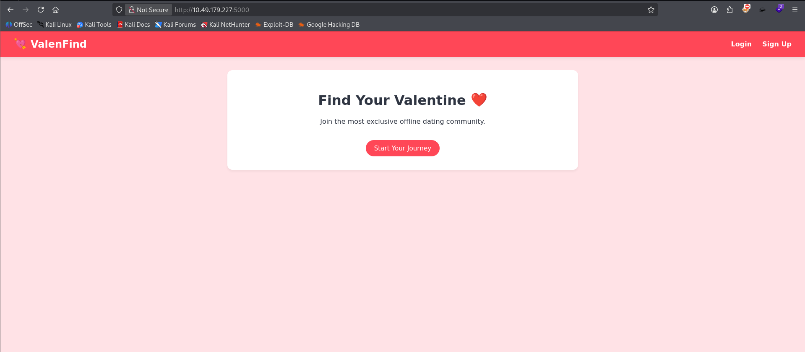
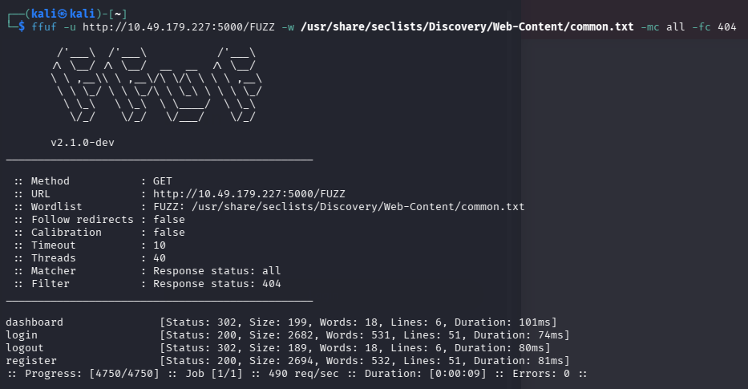
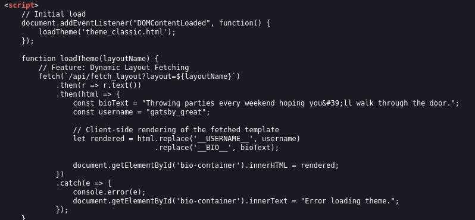
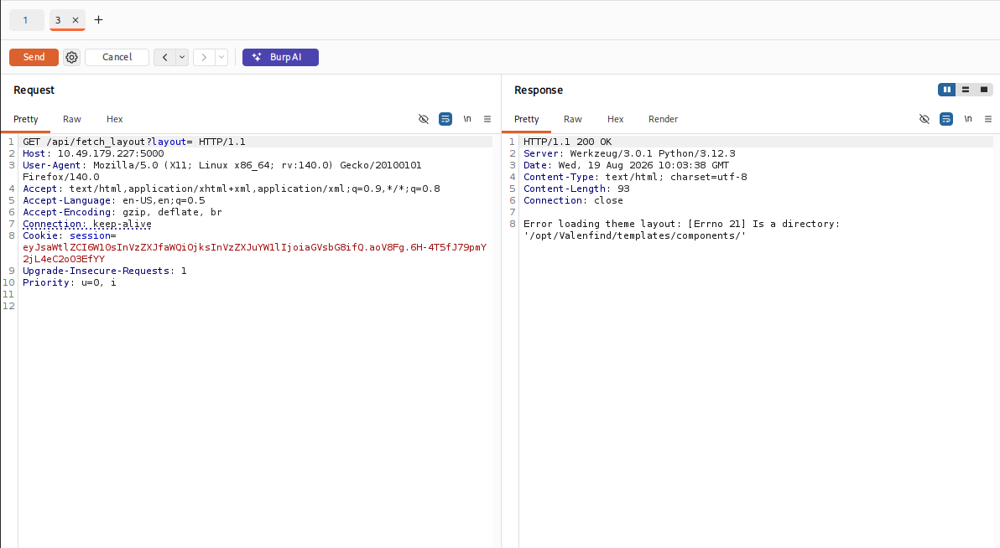
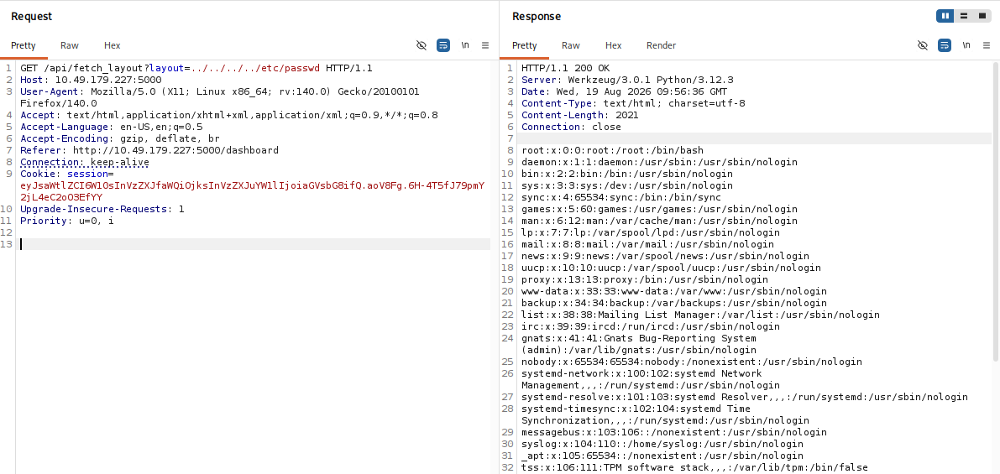
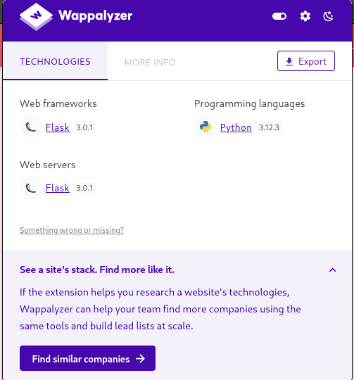
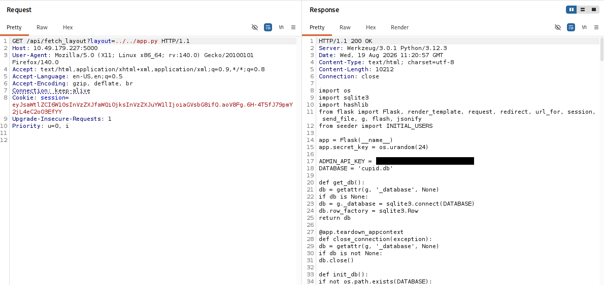
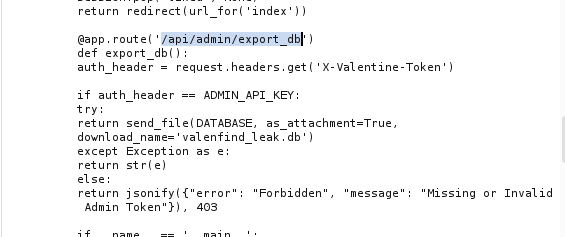
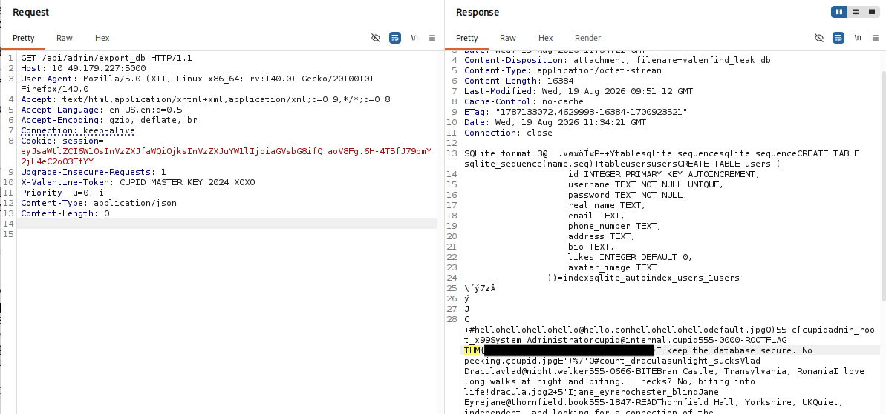

# Valenfind

**Platform:** TryHackMe
**Difficulty:** Medium
**Category:** Web

Link: https://tryhackme.com/room/lafb2026e10

---

# Reconnaissance

I started with an Nmap scan to identify open ports, services, and versions. Normal scan was blocking the scan, I modified with a No-Ping and used Port 53 (DNS) as DNS port will be allowed eventually.

```bash
sudo nmap -Pn -sV -sC -g 53 -p- 10.49.179.227
```



The scan revealed the web application running on **port 5000**.

I accessed the application at:

```text
http://10.49.179.227:5000
```



---

# Directory Enumeration

I then performed directory enumeration using `ffuf`:

```bash
ffuf -u http://10.49.179.227:5000/FUZZ \
-w /usr/share/seclists/Discovery/Web-Content/common.txt \
-mc all -fc 404
```




I also ran a Nuclei scan:

```bash
nuclei -u http://10.49.179.227:5000
```

Neither scan revealed anything immediately useful.

I therefore moved on to manually inspecting the application's source code.

---

# Source Code Inspection

While inspecting the profile page, I found JavaScript responsible for dynamically loading the profile layout:



I found an interesting parameter:

```javascript
fetch(`/api/fetch_layout?layout=${layoutName}`)
```

The `layout` value was being passed directly to the backend.

The normal request was:

```http
GET /api/fetch_layout?layout=theme_classic.html
```

This suggested that the backend was dynamically reading a file based on the supplied parameter.

---

# Path Traversal

I captured the request in **Burp Suite Repeater** and modified the `layout` parameter.

The server response revealed the directory being used by the application:



```text
/opt/Valenfind/templates/components/
```

Since the application was reading files from this directory and the filename was user-controlled, I changed the parameter to test for path traversal.

```http
GET /api/fetch_layout?layout=../../../../etc/passwd HTTP/1.1
Host: 10.49.179.227:5000
```



The server returned the contents of `/etc/passwd`.

This confirmed a **Path Traversal / Arbitrary File Read** vulnerability.

The vulnerable flow was:

```text
User-controlled layout parameter
            ↓
     File path construction
            ↓
          open()
            ↓
     File contents returned
```

The application failed to properly restrict the requested file to the intended `templates/components/` directory.

---

# Futher Enumeration

Since arbitrary file read was confirmed, I started looking for application source files and check the Website's Tech Stack.



The application appeared to be written in Python, so I searched for Python files and other potentially interesting configuration files.

Eventually, I found:

```text
app.py
```



The source revealed:

```python
ADMIN_API_KEY = "<REDACTED>"
DATABASE = 'cupid.db'
```

This gave me two important pieces of information:

* An administrative API key
* The name of the SQLite database

The application used SQLite through Python's `sqlite3` module:

```python
def get_db():
    db = getattr(g, '_database', None)
    if db is None:
        db = g._database = sqlite3.connect(DATABASE)
        db.row_factory = sqlite3.Row
    return db
```

The database was:

```text
cupid.db
```

---

# Discovering the Admin Endpoint

While reviewing `app.py`, I found an administrative database export endpoint:



The endpoint expected the API key in the header:

```http
X-Valentine-Token
```

Since the API key had already been obtained from `app.py`, I could authenticate to this endpoint.

---

# Exporting the Database

I crafted the following request in **Burp Suite Repeater**:



The server accepted the token and returned the SQLite database.

---

# Extracting the Flag

The database contained the application's user information and challenge-related data.

The flag was present in the database, allowing me to complete the room.

---

# Attack Chain

```text
             Web Application
                    │
                    ▼
          Source Code Inspection
                    │
                    ▼
        /api/fetch_layout?layout=
                    │
                    ▼
             Path Traversal
                    │
                    ▼
          Arbitrary File Read
                    │
                    ▼
                app.py
                    │
             ┌──────┴──────┐
             ▼             ▼
       ADMIN_API_KEY    cupid.db
             │
             ▼
   /api/admin/export_db
             │
             ▼
    X-Valentine-Token
             │
             ▼
       SQLite Database
             │
             ▼
            Flag
```

---

# Root Cause

### Path Traversal / Arbitrary File Read

The `layout` parameter was incorporated into a filesystem path without sufficient validation, allowing access to files outside the intended template directory.

### Sensitive Information Disclosure

The arbitrary file read allowed access to `app.py`, exposing sensitive application configuration.

### Hardcoded Administrative Secret

The administrative API key was stored directly in the application source code:

```python
ADMIN_API_KEY = "<REDACTED>"
```

### Sensitive Database Export

The `/api/admin/export_db` endpoint allowed the entire SQLite database to be downloaded when the correct administrative token was supplied.

---

# Conclusion

The initial entry point was the vulnerable `/api/fetch_layout` endpoint.

By manipulating the `layout` parameter with path traversal sequences, I was able to escape the intended template directory and read arbitrary files.

Reading `app.py` exposed the administrative API key and revealed that the application used a SQLite database named `cupid.db`.

I then used the discovered API key with `/api/admin/export_db` to obtain the database, where the flag was found.
